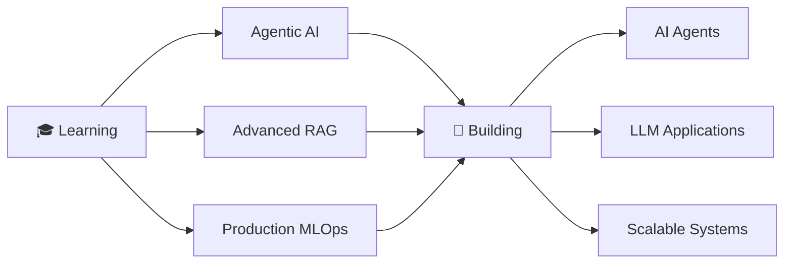

<div align="center">

# 👋 Hey, I'm Titikshit Sumbria

### Building Intelligent Systems | ML Engineer | AI Enthusiast


[](https://www.linkedin.com/in/titikshit-sumbria-9b922724a/)
[](mailto:titikshit@gmail.com)
[](https://x.com/_Developer_01)

</div>

---

## 🚀 About Me

CS undergrad at **SGSITS Indore** with a passion for **building production-grade AI systems**. I specialize in transforming complex ML models into scalable, real-world applications that solve actual problems.

Currently diving deep into **Agentic AI** while architecting intelligent systems that combine **LLMs, RAG, and MLOps** best practices.

```python
class Titikshit:
    def __init__(self):
        self.role = "ML Engineer & AI Developer"
        self.location = "Indore, India 🇮🇳"
        self.education = "B.E. Computer Science @ SGSITS"
        self.current_focus = ["Agentic AI", "RAG Systems", "MLOps"]
        self.learning = "DeepLearning.AI Agentic AI Course"
    
    def get_specialties(self):
        return {
            "ML_Engineering": ["Model Training", "Pipeline Optimization", "Deployment"],
            "Deep_Learning": ["Transformers", "BERT", "LSTM", "NLP"],
            "Production_AI": ["FastAPI", "Docker", "MLOps", "Microservices"],
            "LLM_Systems": ["RAG", "LangChain", "Vector DBs", "AI Agents"]
        }
```

---

## 💻 Tech Arsenal

### **Core Languages**


### **ML & Deep Learning**


### **LLM & AI Frameworks**


### **MLOps & Deployment**


---

## 🔥 Featured Projects

### 🤖 [Customer Churn Predictor](https://github.com/titikshit/customer-churn-predictor)
**Production MLOps System** | `FastAPI` `Docker` `Scikit-learn` `Streamlit`

End-to-end ML pipeline achieving **84% accuracy** on 10K+ records, deployed as microservices with:
- ⚡ FastAPI backend processing **500+ daily requests** with <200ms response time
- 🐳 Dockerized deployment on Render Cloud
- 📊 Interactive Streamlit dashboard serving 50+ stakeholders
- 🎯 **70% reduction** in manual analysis time

### 📰 [Fake News Detection System](https://github.com/titikshit/fake-news-detector)
**Research Project** | `BERT` `LSTM` `TensorFlow` `NLP`

Deep learning system trained on **25K+ articles** with **92% accuracy**:
- 🧠 BERT transformers + LSTM neural networks
- 🔍 Comprehensive EDA with **500+ linguistic patterns** extracted
- 📈 Three distinct architectures for performance benchmarking
- 🛠️ NLTK & TF-IDF feature engineering

### 📚 [RAG Review - Intelligent Document Query](https://github.com/titikshit/rag-review)
**Production RAG System** | `LangChain` `FAISS` `OpenAI` `Streamlit`

Production-grade RAG system with **95% answer accuracy**:
- 🗂️ Processes 100+ PDFs with semantic search
- ⚡ <2 second query response time
- 💬 Maintains 50+ turn contextual dialogues
- 📦 Batch processing of 20+ documents, **60% productivity boost**

---

## 📊 GitHub Analytics

<div align="center">
  


</div>

---

## 🎯 Current Focus



**Currently Working On:**
- 🤖 **Agentic AI Course** by DeepLearning.AI (Andrew Ng)
- 🔨 Building autonomous AI agents with **CrewAI** & **LangChain**
- 🏗️ Architecting production-ready LLM applications
- 📖 Exploring cutting-edge research in **multi-agent systems**

---

## 🏆 Achievements & Leadership

<table>
<tr>
<td width="50%">

### 💼 Finance Committee Head
Directed financial ops for **500+ attendee festival**
- 💰 Managed **₹1.5L+ budget** with zero variance
- 🤝 Secured funding from **15+ sponsors**

</td>
<td width="50%">

### 🏐 Volleyball Team Captain
Led team to **gold medal victory**
- 👥 Managed 12-member team
- 🥇 Inter-college tournament champion

</td>
</tr>
</table>

🏅 **Smart India Hackathon 2023** - Qualified among 200+ participants

---

## 📫 Let's Connect

I'm always excited to collaborate on **innovative AI projects** or discuss **machine learning, agentic AI, and production systems**.

<div align="center">

[](https://www.linkedin.com/in/titikshit-sumbria-9b922724a/)
[](mailto:titikshit@gmail.com)
[](https://github.com/titikshit)

**Open to:** Research Collaborations • Internships • ML/AI Projects • Freelance Opportunities

</div>

---

<div align="center">

### 💡 *"Building the future, one intelligent system at a time"*


</div>
